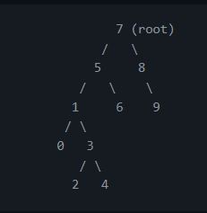

# __Veri Yapıları ve Algoritmalar__
# __Binary Search Tree Projesi__
## __Proje 3__
__https://github.com/metebilgicofficial/kodluyoruzBinarySearchTreeProjesi__

__https://metebilgicofficial.github.io/kodluyoruzBinarySearchTreeProjesi/__

## ***[7, 5, 1, 8, 3, 6, 0, 9, 4, 2] dizisinin Binary-Search-Tree aşamalarını yazınız.***

## *Rootu __7__ aldım. Sağ tarafında büyük sayılar, sol tarafında küçük sayılar olacak şekilde bölüyorum.*

## License
[MIT](https://tr.wikipedia.org/wiki/MIT_Lisans%C4%B1)
## Patika
[Patika](https://www.patika.dev/tr)